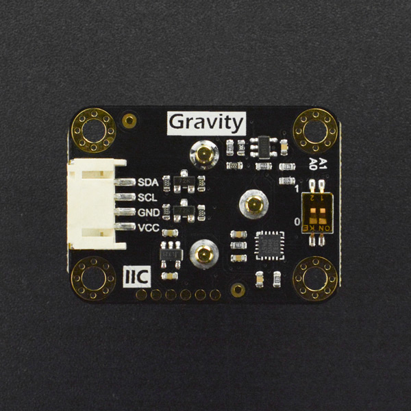

# DFRobot_EOxygenSensor
- [English Version](./README.md)

DFRobot推出的全量程氧气传感器，信号板内置校准算法，可快速进行单点或双点校准，I2C数字输出，能够准确测量环境中的氧气浓度。探头采用电化学原理，并具有抗干扰能力强、稳定性高、灵敏度高等特点，使用寿命长达两年。兼容Arduino、ESP32、树莓派等主流的主控设备，简单易用的Gravity接口，配上我们的样例代码，可迅速搭建出自己的氧气浓度检测仪。<br>




## 产品链接（链接到中文商城）

    SKU：SEN0496

## 目录

  * [概述](#概述)
  * [库安装](#库安装)
  * [方法](#方法)
  * [兼容性](#兼容性)
  * [历史](#历史)
  * [创作者](#创作者)

## 概述

* 范围 0-100% O2<br>
* 精度 0.01% O2<br>
* 信号中100%的氧 100±1% <br>
* 线性 0-100%O2<br>
* 温度范围 -20 — +50 C<br>
* 压差范围 0-500mbar Max<br>
* 绝对压力范围内 500-2000mbar<br>
* 相对湿度范围 0-99% 非凝结性<br>

## 库安装

这里提供两种使用本库的方法:<br>
1.打开Arduino IDE,在状态栏中的Tools--->Manager Libraries 搜索"DFRobot_EOxygenSensor"并安装本库.<br>
2.首先下载库文件,将其粘贴到\Arduino\libraries目录中,然后打开examples文件夹并在该文件夹中运行演示.<br>

## 方法

```C++
  /**
   * @fn readOxygenConcentration
   * @brief 获取氧气浓度 单位 vol
   * @return concentration
   */
  float readOxygenConcentration(void);

  /**
   * @fn readCalibrationState
   * @brief 检测校准状态
   * @return state
   */
  uint8_t readCalibrationState(void);

  /**
   * @fn calibration_20_9
   * @brief 在氧气浓度为 20.9% Vol 的空气中校准
   * @return Calibration state
   */
  bool calibration_20_9(void);

  /**
   * @fn calibration_99_5
   * @brief 在氧气浓度为 99.5% Vol 的空气中校准
   * @return Calibration state
   */
  bool calibration_99_5(void);

  /**
   * @fn clearCalibration
   * @brief 清空校准数据
   * @return clear state
   */
  bool clearCalibration(void);
```

## 兼容性

| 主板        | 通过 | 未通过 | 未测试 | 备注 |
| ----------- | :--: | :----: | :----: | ---- |
| Arduino uno |  √   |        |        |      |
| Mega2560    |  √   |        |        |      |
| Leonardo    |  √   |        |        |      |
| ESP32       |  √   |        |        |      |
| micro:bit   |      |        |   √    |      |


## 历史

- 2021/12/28 - V1.0.0 版本

## 创作者

Written by ZhiXinLiu(ZhiXin.Liu@dfrobot.com), 2021. (Welcome to our [website](https://www.dfrobot.com/))