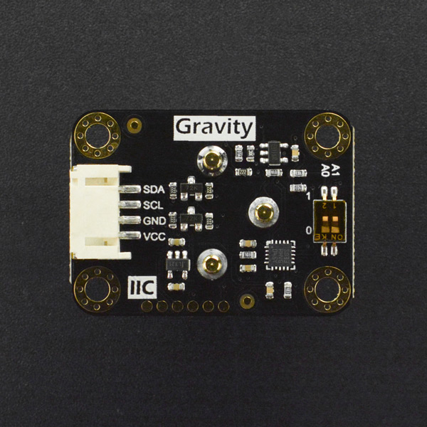

# DFRobot_EOxygenSensor
- [English Version](./README.md)

DFRobot推出的全量程氧气传感器，信号板内置校准算法，可快速进行单点或双点校准，I2C数字输出，能够准确测量环境中的氧气浓度。探头采用电化学原理，并具有抗干扰能力强、稳定性高、灵敏度高等特点，使用寿命长达两年。兼容Arduino、ESP32、树莓派等主流的主控设备，简单易用的Gravity接口，配上我们的样例代码，可迅速搭建出自己的氧气浓度检测仪。<br>




## 产品链接（链接到中文商城）

    SKU：SEN0496

## 目录

  * [概述](#概述)
  * [库安装](#库安装)
  * [方法](#方法)
  * [兼容性](#兼容性)
  * [历史](#历史)
  * [创作者](#创作者)

## 概述

* 范围 0-100% O2<br>
* 精度 0.01% O2<br>
* 信号中100%的氧 100±1% <br>
* 线性 0-100%O2<br>
* 温度范围 -20 — +50 C<br>
* 压差范围 0-500mbar Max<br>
* 绝对压力范围内 500-2000mbar<br>
* 相对湿度范围 0-99% 非凝结性<br>

## 库安装

要使用这个库，首先将库下载到Raspberry Pi，然后打开例程文件夹。要执行一个例程demox.py，请在命令行中输入python demox.py。例如，要执行control_led.py例程，你需要输入:

```python
python calibrationSensor.py
python getOxygenConcentration.py
```

## 方法

```python
  '''!
    @brief 获取空气中的氧气浓度，单位 VOL
    @return concentration
  '''
  def read_oxygen_concentration(self):

  '''!
    @brief 获取校准的状态
    @return state
  '''
  def read_calibration_state(self):

  '''!
    @brief 在20.9% 的空气中校准传感器
    @return 校准状态
  '''
  def calibration_20_9(self):

  '''!
    @brief 在99.5% 的纯氧中校准传感器
    @return 校准状态
  '''
  def calibration_99_5(self):

  '''!
    @brief 清除校准状态
    @return 校准状态
  '''
  def clear_calibration(self):
```

## 兼容性

| 主板         | 通过 | 未通过 | 未测试 | 备注 |
| ------------ | :--: | :----: | :----: | :--: |
| RaspberryPi2 |      |        |   √    |      |
| RaspberryPi3 |      |        |   √    |      |
| RaspberryPi4 |  √   |        |        |      |

* Python 版本

| Python  | 通过 | 未通过 | 未测试 | 备注 |
| ------- | :--: | :----: | :----: | ---- |
| Python2 |  √   |        |        |      |
| Python3 |  √   |        |        |      |

## 历史

- 2021/12/29 - 1.0.0 版本

## 创作者

Written by ZhiXinLiu(ZhiXin.Liu@dfrobot.com), 2021. (Welcome to our [website](https://www.dfrobot.com/))

